# Spring Resilience4j Example
- Resilience4j: Fault Tolerance 라이브러리로 Circuit Breaker, Rate Limiter, Bulkhead, Retry 등의 모듈들이 존재함

## Circuit Breaker
- Fault Tolerance 에서 사용되는 대표적인 패턴으로, 서비스 호출간 예외가 발생하여 요청이 실패하는 경우 Circuit 를 오픈하여 장애가 다른 서비스로 전파되지 못하도록 설정

### Sliding Window
- CircuitBreaker는 호출 결과를 저장하고 집계하기 위해 슬라이딩 윈도우 방식을 사용함
- Count-based sliding window, Time-based sliding window 를 선택할 수 있다. (디폴트는 Count-based)
  - Count-based: 마지막 N 개의 호출 결과 집계
  - Time-based: 마지막 N 초의 호출 결과 집계

#### Count-based sliding window
- 사이즈가 N인 원형 배열로 구현
- 새로운 호출 결과가 기록되면 총 집계가 점진적으로 업데이트되고, 가장 오래된 기록이 제거되면 총 집계에서 차감되고 버킷이 재설정됨

#### Time-based sliding window
- 사이즈가 N인 부분 집합의 원형 배열로 구현
- 호출 결과를 개별적으로 저장하지 않고 부분 집계와 총 집계를 점진적으로 업데이트

### State Transition -  Failure rate and slow call rate thresholds

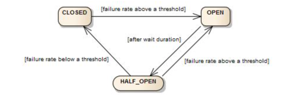

| 상태        | 설명                                                                                                                 |
|-----------|--------------------------------------------------------------------------------------------------------------------|
| CLOSED    | 초기 상태, 모든 연결 성공                                                                                                    |
| OPEN      | 에러율이 임계치를 넘어가면 OPEN 상태로 변경, 모든 접속 차단 (Fail Fast), 실제 요청을 실행하지 않고 에러 및 디폴트 응답 처리                                    |
| HALF_OPEN | OPEN 상태 중간에 한 번씩 요청을 날려 응답이 성공하는지 확인하는 상태, OPEN 후 일정 시간이 경과하면 HALF_OPEN 상태로 변경, 중간에 접속 체크하여 성공하면 CLOSED, 실패하면 OPEN |

#### CLOSED -> OPEN
- 실패율이 설정된 임계값(threshold) 이상일 경우
  - 기본적으로는 모든 예외가 실패로 집계되지만, 설정이 가능함
- 느린 호출의 비율이 설정된 임계값 이상일 경우
- 실패율 & 느린 호출 비율은 설정된 최소 호출 횟수 이후부터 측정됨
  - 최소 호출이 10회라면, 10회보다 적은 호출에 대해서는 성공&실패를 집계하지 않음

#### OPEN -> HALF_OPEN
- 서킷브레이커의 상태가 OPEN 된 후 설정된 시간이 경과했을 때 서킷브레이커는 상태를 HALF_OPEN 으로 변경
- HALF_OPEN 상태에서는 여전히 호출이 불가능한지, 아니면 가능한지 판단하여 OPEN 혹은 CLOSED 상태로 변경

#### DISABLED, FORCED_OPEN
- DISABLED: 항상 접근 허용
- FORCED_OPEN: 항상 접근 거부

### CircuitBreaker Configuration
`CircuitBreakerConfig`를 통해 전역의 커스텀한 설정이 가능함 (설정 프로퍼티, 설명 등은 아래 링크 참고) 
  - https://resilience4j.readme.io/docs/circuitbreaker#create-and-configure-a-circuitbreaker

### CircuitBreaker Sample
- slidingWindowSize (array size): 5
- minimumNumberOfCalls (Circuit 동작을 위한 최소한의 호출 수): 3
- failureRateThreshold (Circuit 이 OPEN되는 실패율): 50(%)
- slowCallDurationThreshold (느린 호출로 판단하는 시간): 3000(ms)

| 호출 순서         | 1      | 2   | 3   | 4   | 5 | 6 |
|---------------|--------|-----|-----|-----|----|----|
| 성공 / 실패       | 성공     | 실패  | 성공  | 성공  | 실패 | 실패 |
| 실패율(%)        | 0      | 50% | 33% | 25% | 40% | 60% |
| Circuit State | CLOSED | CLOSED    | CLOSED    | CLOSED    | CLOSED | OPEN |

- 2번째 호출에서 실패율이 50%가 되었지만, 최소 호출 수가 3보다 작기 때문에 상태는 CLOSED, 
- 원형 배열의 사이즈(slidingWindowSize)가 5이기 때문에 6번째 호출 시 최초 호출인 1은 evicted 되고, 나머지 호출순서 2~6을 기준으로 계산

### Test

최초 상태 <br>
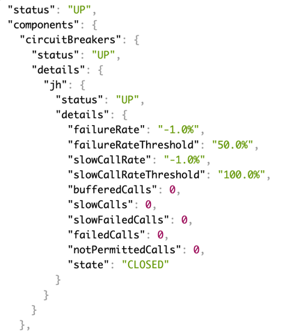

첫 번째 호출 - 성공 <br>
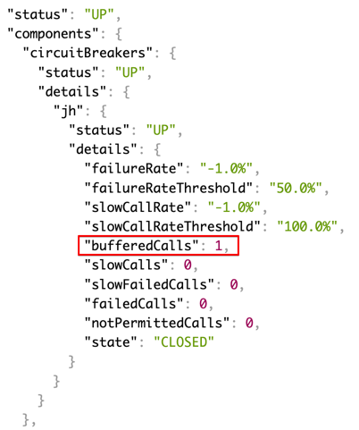

두 번째 호출 - 실패 <br>
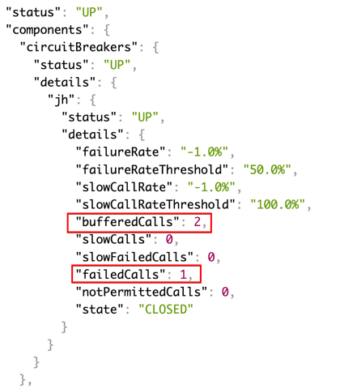

세 번째 호출 - 성공 <br>
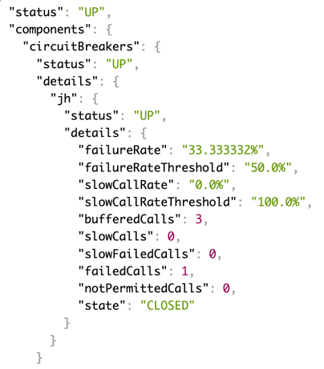

네 번째 호출 - 성공 (실패율 25%) <br>
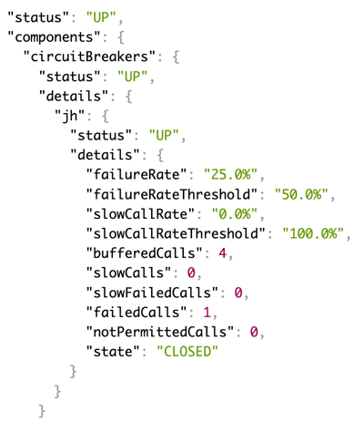

다섯 번째 호출 - 실패 (실패율 40%) <br>
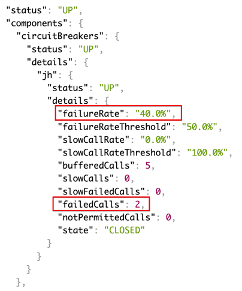

여섯 번째 호출 - 실패 (실패율 50%), Circuit State (OPEN) <br>
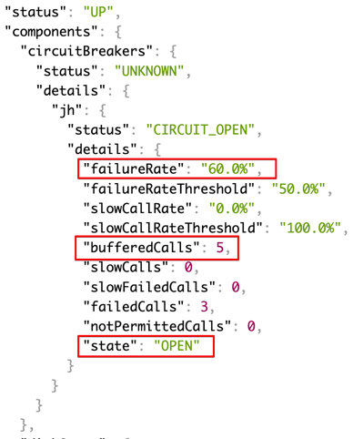

여섯 번째 호출 후 duration 시간 지난 후 Circuit State (OPEN -> HALF_OPEN) <br>
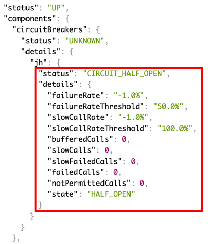

- bufferedCalls 는 최초 설정한 slidingWindowSize 를 초과하지 않음
- waitDurationInOpenState 설정 값동안 서킷브레이커가 OPEN 이 되어 호출이 차단되고, duration 지난 후 호출하면 HALF_OPEN 상태로 변경되고, 이후 호출 결과에 따라 OPEN, CLOSED 상태로 변경
  - duration 지난 후 자동으로 서킷 상태가 OPEN -> HALF_OPEN 으로 변경하려면 `automatic-transition-from-open-to-half-open-enabled: true` 설정

### References
- https://resilience4j.readme.io/docs/circuitbreaker

<br><br>

## RateLimiter (처리율 제한)
- RateLimiter (처리율 제한)은 단위 시간동안 얼마만큼의 실행(요청)을 허용할 것인지 제한하는 기능
- 처리율 제한 구현 라이브러리는 Bucket4j, Guava, RateLimitJ(Deprecated), Resilience4j 등이 존재하며, 처리율 제한을 목적으로 한 Bucket4j, Guava 등의 오픈 소스가 더 적합할 수 있으나, 
해당 프로젝트는 Resilience4j 라이브러리를 기준으로 작성하기 때문에, Resilience4j 가 제공하는 RateLimiter 를 사용한다.

### RateLimiter 사례
- 사용자는 초당 2회 이상 새 글을 올릴 수 없다.
- 특정 API 호출은 3초동안 최대 10회까지 허용한다.
- 같은 IP 주소로는 하루에 10개 이상의 계정을 생성할 수 없다.

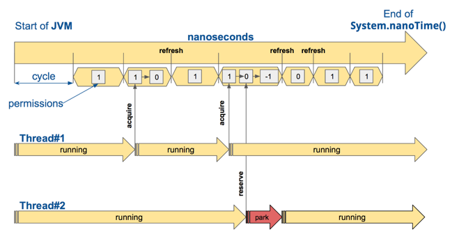
- JVM 시작과 함께 System.nanoTime() 을 일정 단위 시간(limitRefreshPeriod)로 쪼개고, 단위 시간 동안 허가되는 요청수(limitForPeriod)를 설정한다.

### RateLimiter 이점
- Dos(Denial of Service) 공격에 의한 자원 고갈을 방지할 수 있다.
  - 트위터는 3시간 동안 300개의 트윗만 올릴 수 있도록 제한
  - 구글 독스 API는 사용자당 분당 300회의 read 요청만 허용
- 비용 절감, 서버 과부하 방지 등

### Configuration
- `timeoutDuration`: 호출 스레드가 접근 허가를 위해 대기하는 시간 (기본값: 5s)
- `limitRefreshPeriod`: cycle 이 초기화 되는 주기, cycle 주기가 끝나면 호출 가능 횟수는 limitForPeriod 값 만큼 초기화 (기본값: 500ns)
- `limitForPeriod`: 하나의 cycle 주기 동안 호출할 수 있는 횟수 (기본값: 50회)

```yaml
resilience4j:
  ratelimiter:
    configs:
      default:
        # 10초동안 최대 5회의 호출이 가능한 RateLimiter
        timeout-duration: 1s # 접근 허가를 위해 대기하는 시간
        limit-refresh-period: 10s # cycle 이 초기화 되는 주기
        limit-for-period: 5 # cycle 동안 호출 가능한 횟수
```
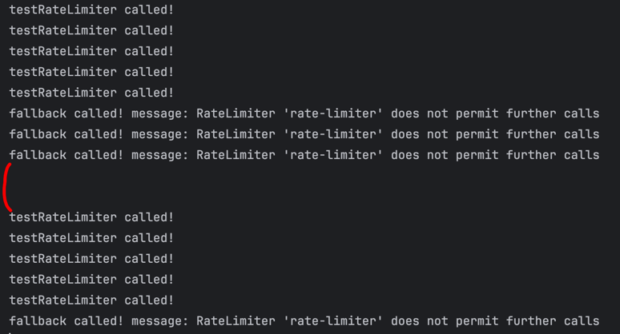
- 10초안에 RateLimiter 설정한 API 를 5회 이상 호출하면 5회까지는 정상 성공, 5회 초과는 fallback 메서드 호출

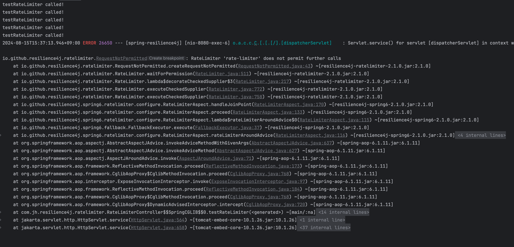
- fallback 메서드를 설정하지 않았을경우, RequestNotPermitted 예외 발생 -> 429(Too Many Request) 응답 코드로 내려줄 수 있음

### References
- https://resilience4j.readme.io/docs/ratelimiter
- https://leedongyeop.notion.site/4-8d4fcdfc382e41b4bcb1b17731463140
- https://developer.mozilla.org/ko/docs/Web/HTTP/Status/429
